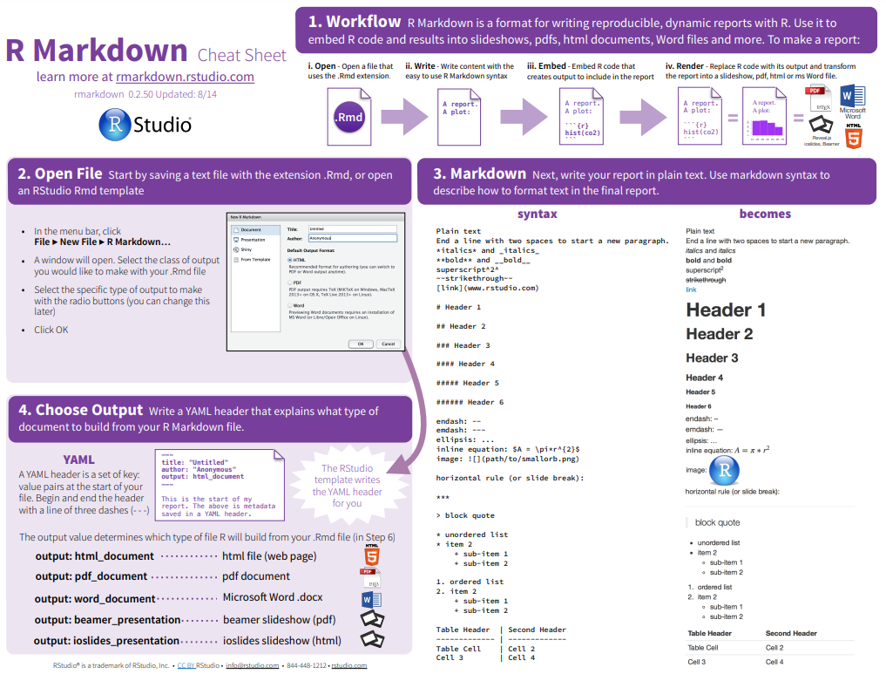

```{r}
# Rode se não tiver instalado
# install.packages("utf8")
```


```{r}
library(utf8)
Sys.setlocale("LC_CTYPE", "en_US.UTF-8")
```


# Criando um arquivo R markdown

O R Markdown é a junção da linguagem Markdown com o poder de códigos em R. 

O caminho para criar um arquivo R markdown é: `File > New File > R Markdown`.

Uma janela será aberta, chamada New R Markdown. Coloque um título, um autor, selecione o HTML e clique em ok.

Agora, quando quiser gerar o HTML do seu arquivo, basta cliar em `Knit` na barra.




# Estrutura do arquivo R Markdown

1. **YAML** - Uma seção de metadados, que apresenta códigos `YAML`. Essa seção apresenta informações que serão usadas para gerar o arquivo final, como por exemplo: título do relatório, autoria, data, formato gerado, etc. É necessário cuidado ao editar essa seção, pois coisas simples como indentação incorreta, fechamento incorreto de textos, etc, podem resultar em um erro ao gerar seu relatório. Essa seção deve estar sempre ao início do documento, e é delimitado por três traços no começo e no final: `---`.

2. **Markdown** - Textos marcados com Markdown podem ser adicionados ao longo do relatório, fora das demarcações do YAMl e dos Chunks.

3. **Chunks** - Nos campos de código (também chamados de chunks) podemos adicionar códigos em R (ou em algumas outras linguagens). Os chunks são delimitados por três crases, e a linguagem deve ser especificada entre chaves. Exemplo de um chunk que apresenta código em R:

```{r}
1 + 1 
```


## YAML

Aqui você irá configurar o estilo e propriedades do HTML que será gerado. Deixo dois sites se quiser personalizar do seu jeito o HTML:

[https://cran.r-project.org/web/packages/ymlthis/vignettes/yaml-overview.html](Basic syntax)

[https://zsmith27.github.io/rmarkdown_crash-course/lesson-4-yaml-headers.html](YAML Headers)

Segue o exemplo que utilizo:

```
---
title: "Markdown - Aula 0"
author: "Fabrício"
date: "2023-04-25"
output: 
  html_document:
    number_sections: yes
    highlight: tango
    theme: cerulean
    toc: yes
    toc_float:
      collapsed: yes
      smmoth_scroll: no
  pdf_document:
    toc: yes
---

```

## Markdown

### Títulos

Podemos criar títulos colocando `#`, como podemos ver em todo esse arquivo:

```
# Título 1
## Título 2
### Título 3
#### Título 4
##### Título 5
```

### Ênfase

#### Negrito

Para destacar um __texto__ em **negrito**, coloque `**` ou `__` ao redor do texto.

#### Itálico

Para destacar um _texto_ em *itálico*, coloque `*` ou `_` ao redor do texto.

#### Riscado 

Para riscar/tachar um ~~texto~~ , coloque `~~` ao redor do texto.


### Listas

Você pode fazer uma lista ordenada usando somente números. Você pode repetir o número quantas vezes quiser:

Como é escrito no código:

```
1. Maçã

2. Banana

3. Uva
```

1. Maçã

1. Banana

1. Uva

Você pode fazer uma lista não ordenada escrevendo com hífens ou asteriscos, como a seguir:

```
* Maçã

* Banana

* Uva
```

* Maçã

* Banana

* Uva


Você também pode adicionar sub-itens na lista indicando a hierarquia através da identação no Markdown (dica: utilize a tecla tab do teclado):

```
* Maçã

  * Banana

* Uva
```

* Maçã

  * Banana

* Uva


### Equações

Você pode adicionar equações utilizando LaTeX. 

```
$$y = \mu + \sum_{i=1}^p \beta_i x_i + \epsilon$$	
```

$$y = \mu + \sum_{i=1}^p \beta_i x_i + \epsilon$$	

Também é possível adicionar a equação na mesma linha que o texto, envolvendo o código com `$`. Veja o exemplo abaixo:

```
Ou também na linha $y = \mu + \sum_{i=1}^p \beta_i x_i + \epsilon$ , junto ao texto!
```
Ou também na linha $y = \mu + \sum_{i=1}^p \beta_i x_i + \epsilon$ , junto ao texto!


### Código

Esse eu estou utilizando o tempo todo ao longo do arquivo. 

É possível marcar textos para que fiquem formatados como códigos, usando a crase: ` 

Mas atenção: o texto será formatado como código, porém não será executado!

Como é escrito no código:

```
library(dados)
mean(pinguins$massa_corporal, na.rm = TRUE)
```

### Links

Você pode criar um link utilizando esta estrutura:

```
[github](https://github.com/FabricioVenturim)
```

[github](https://github.com/FabricioVenturim)


### Imagens

Você pode incluir uma imagem utilizando esta estrutura:

```

```


### Tabelas

Podemos gerar tabelas com o seguinte código:

[Site para gerar tabelas](https://www.tablesgenerator.com/markdown_tables)

```
| Nome  | Descrição             | Tipo   | Domínio |
|------:|----------------------:|-------:|--------:|
| Nome  | Nome da administração | String | A-Z     |
| Senha | Senha do aluno        | Int    | 0-9     |
```

| Nome  | Descrição             | Tipo   | Domínio |
|------:|----------------------:|-------:|--------:|
| Nome  | Nome da administração | String | A-Z     |
| Senha | Senha do aluno        | Int    | 0-9     |


## Chunks 

Agora que iremos criar os locais para nossos códigos. Podemos adicionar códigos nos nossos relatórios que geram os resultados, assim a cada vez que compilarmos o relatório, os códigos que geram estes resultados serão executados, e o relatório terá sempre os resultados atualizados.

É possível adicionar campos aperte ``Ctrl + alt + I`.

```{r}
# Imprime a mensagem "Olá, mundo!"
print("Ola, mundo!")
```
Percebe-se que eu criar um chunk aparece um botão verde no lado esquerdo para rodar o códigio. Após apertar em Knit, ele irá rodar todos os códgios e salvará o output no HTML, mas você também pode ir rodando por aqui mesmo (o certo).

Mais alguns exemplos:

```{r}
# Cria um vetor com os números de 1 a 5
vetor <- c(1, 2, 3, 4, 5)

# Calcula a média do vetor
media <- mean(vetor)

# Imprime a média na tela
print(media)
```

```{r}
# Cria um vetor com os valores de x
x <- c(1, 2, 3, 4, 5)

# Cria um vetor com os valores de y
y <- c(2, 4, 6, 8, 10)

# Faz um gráfico de dispersão com os valores de x e y
plot(x, y)
```

Com isso é suficiente para criar seus arquivos em R e realizar as atividades.

## Básico de R e ggplot

Essa parte eu passei levemente na monitoria e vocês podem encontrar nos arquivos `NotasDeAula_R` e `NotasDeAula_ggplot2`.

## Atividade

Deixo como atividade pegar `NotasDeAula_R` e `NotasDeAula_ggplot2` e fazer um resumo deles utilizando Markdown e ir testando os códigos aqui mesmo ou em um arquivo separado. Possivelmente a Asla já irá pedir para vocês fazerem isso em alguma atividade.

Por fim, fico grato por ter lido até aqui, qualquer dúvida pode me enviar pelo whatsapp :)

