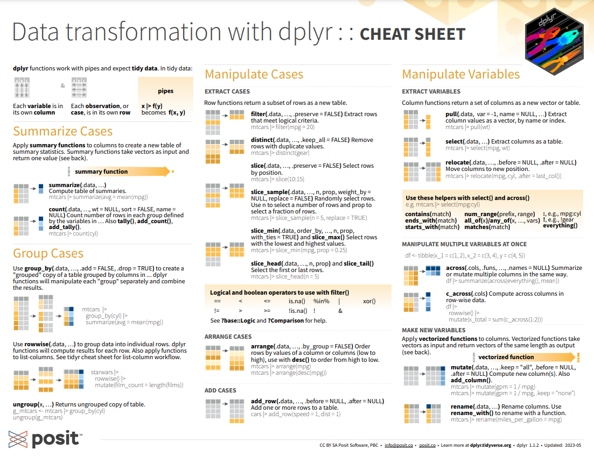
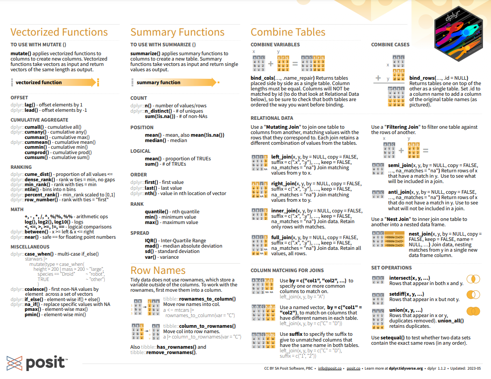

```{r}
if(!require(utf8)) install.packages("utf8") 

library(utf8)
Sys.setlocale("LC_ALL", "pt_br.utf-8") 
```

A limpeza de dados é uma parte fundamental da ciência de dados, **mas pode ser profundamente frustrante**. Por que alguns de seus campos de texto estão ilegíveis? O que você deve fazer sobre esses valores ausentes? Por que suas datas não estão formatadas corretamente? Como você pode limpar rapidamente a entrada de dados inconsistentes? Nesta aula, você aprenderá por que se deparou com esses problemas e, mais importante, como corrigi-los!

Nesta aula, você aprenderá como lidar com alguns dos problemas mais comuns de limpeza de dados para que possa realmente analisar seus dados mais rapidamente.





# Manipulando valores ausentes

## Dê uma primeira olhada nos dados

A primeira coisa que precisamos fazer é carregar as bibliotecas e o conjunto de dados que usaremos.

Para demonstração, usaremos um conjunto de dados de eventos ocorridos em jogos de futebol americano.

```{r}
if(!require(tidyverse)) install.packages("tidyverse")
#if(!require(dplyr)) install.packages("dplyr")
```

```{r}
library(tidyverse)
#library(dplyr)
```


```{r}
nfl_data <- read.csv("data/NFL.csv")
```

A primeira coisa a fazer quando você obtém um novo conjunto de dados é dar uma olhada em alguns deles. Isso permite que você veja se tudo foi lido corretamente e dá uma ideia do que está acontecendo com os dados. Nesse caso, vamos ver se há algum valor ausente, que será representado por `NaN` ou `None`.

```{r}
head(nfl_data)
```

```{r}
str(nfl_data)
```

## Quantos dados ausentes temos?

Ok, agora sabemos que temos alguns valores ausentes. Vamos ver quantos temos em cada coluna.

```{r}
#is.na(nfl_data)
quant_dados_faltantes <- colSums(is.na(nfl_data))
quant_dados_faltantes
```
Isso parece muito! Pode ser útil ver qual porcentagem dos valores em nosso conjunto de dados estava faltando para nos dar uma noção melhor da escala desse problema:

```{r}
porcentagem_dados_faltantes <- quant_dados_faltantes / nrow(nfl_data) * 100
porcentagem_dados_faltantes
```

Uau, quase um quarto das células neste conjunto de dados está vazio! Na próxima etapa, examinaremos mais de perto algumas das colunas com valores ausentes e tentaremos descobrir o que pode estar acontecendo com elas.

## Descubra por que os dados estão faltando

Este é o ponto em que entramos na parte da ciência de dados que gosto de chamar de **"data intution"**, ou seja, "realmente olhando para seus dados e tentando descobrir por que são do jeito que são e como isso vai afetar sua análise". 

Pode ser uma parte frustrante da ciência de dados, especialmente se você for mais novo na área e não tiver muita experiência. Para lidar com valores ausentes, você precisará usar sua intuição para descobrir por que o valor está ausente. Uma das perguntas mais importantes que você pode fazer a si mesmo para ajudar a descobrir isso é:

> Este valor está faltando porque não foi registrado ou porque não existe?

* Se um valor está faltando porque não existe (como a altura do filho mais velho de alguém que não tem filhos), então não faz sentido tentar adivinhar o que pode ser. **Esses valores você provavelmente deseja manter como NaN**. 

* Por outro lado, se um valor estiver faltando porque não foi registrado, você pode tentar adivinhar o que poderia ter sido com base nos outros valores nessa coluna e linha, procurar a procedência daquele dado ou deletar.

Vamos trabalhar com um exemplo. Observando o número de valores ausentes no dataframe `nfl_data`, noto que a coluna "TimesSec" possui muitos valores ausentes:

```{r}
quant_dados_faltantes["TimeSecs"]
```
Observando a [documentação](https://www.kaggle.com/datasets/maxhorowitz/nflplaybyplay2009to2016), vejo que esta coluna contém informações sobre o número de segundos restantes no jogo quando a jogada foi feita. Isso significa que esses valores provavelmente estão ausentes porque não foram registrados, e não porque não existem. Portanto, faria sentido tentarmos adivinhar quais deveriam ser, em vez de apenas deixá-los como NA.

```{r}
quant_dados_faltantes["PenalizedTeam"]
```


Por outro lado, existem outros campos, como "PenalizedTeam" que também possuem muitos campos ausentes. Nesse caso, porém, falta o campo porque se não houve pênalti não faz sentido dizer qual time foi penalizado. Para esta coluna, faria mais sentido deixá-la vazia ou adicionar um terceiro valor como "nenhum" e usá-lo para substituir os NAs.

> Dica: este é um ótimo lugar para ler a documentação do conjunto de dados, caso ainda não o tenha feito! Se você estiver trabalhando com um conjunto de dados que obteve de outra pessoa, também pode tentar contatá-la para obter mais informações.

Se você estiver fazendo uma análise de dados muito cuidadosa, este é o ponto em que você examinaria cada coluna individualmente para descobrir a melhor estratégia para preencher os valores ausentes. No restante deste notebook, abordaremos algumas técnicas "rápidas e sujas" que podem ajudá-lo com valores ausentes, mas provavelmente também acabarão removendo algumas informações úteis ou adicionando algum ruído aos seus dados.

### Eliminar valores ausentes

Se você estiver com pressa ou não tiver um motivo para descobrir por que seus valores estão ausentes, uma opção é simplesmente remover quaisquer linhas ou colunas que contenham valores ausentes. (**Observação: geralmente não recomendo esta abordagem para projetos importantes! Geralmente vale a pena dedicar um tempo para examinar seus dados e realmente examinar todas as colunas com valores ausentes, uma a uma, para realmente conhecer seu conjunto de dados.**)

```{r}
nfl_data_na <- na.omit(nfl_data)
```

```{r}
nfl_data_na
```

Nossa, parece que removemos todos os nossos dados! 😱 Isso ocorre porque cada linha em nosso conjunto de dados tinha pelo menos um valor ausente. Podemos ter mais sorte removendo todas as colunas que têm pelo menos um valor ausente.

```{r}
data_sem_col_na <- select_if(nfl_data, ~ !any(is.na(.)))
```

A função `%>%` é usada para encadear as operações do `dplyr`. A função `select_if()` é usada para selecionar colunas de "nfl_data" de acordo com uma condição. A condição neste caso é uma função anônima `~ !any(is.na(.))`, que é aplicada a cada coluna. A função `~` é uma notação usada pelo dplyr para definir funções anônimas.

A função `is.na()` é usada para verificar se há valores ausentes em cada coluna, e a função `any()` é usada para verificar se pelo menos um valor é ausente. O operador `!` é usado para negar a condição, ou seja, selecionar apenas colunas que não contenham valores ausentes.

Em resumo, este código seleciona todas as colunas de "nfl_data" que não contêm valores ausentes e armazena os dados resultantes na nova variável "columns_with_na_dropped".

```{r}
head(data_sem_col_na)
```
número de colunas no dataframe original:

```{r}
print(ncol(nfl_data))
```

Número de colunas agora:

```{r}
print(ncol(data_sem_col_na))
```


Perdemos muitos dados, mas neste ponto removemos com sucesso todos os NaNs de nossos dados.

### Preencher valores ausentes automaticamente

outra opção é tentar preencher os valores ausentes. Para a próxima parte, estou obtendo uma pequena subseção dos dados da NFL para que sejam bem impressos.

```{r}
subset_nfl_data <- head(select(nfl_data, EPA:Season))
head(subset_nfl_data)
```

Podemos usar a função `replace(is.na(.), 0)` do pacote tidyr no R para preencher os valores ausentes em um data frame. Uma opção é especificar com o que queremos substituir os valores ausentes. Aqui, estamos dizendo que gostaríamos de substituir todos os valores ausentes por 0:

```{r}
nfl_data_filled <- subset_nfl_data %>% 
  replace(is.na(.), 0)
```

```{r}
head(nfl_data_filled)
```

Podemos preencher com a média da coluna:

```{r}
nfl_data_na_mean <- subset_nfl_data %>% 
  mutate_all(~ifelse(is.na(.), mean(., na.rm = TRUE), .))
```

```{r}
head(nfl_data_na_mean)
```


Eu também poderia ser um pouco mais experiente e substituir os valores ausentes por qualquer valor que vier diretamente antes dele na mesma coluna. (Isso faz muito sentido para conjuntos de dados em que as observações têm algum tipo de ordem lógica.)

```{r}
nfl_data_filled <- subset_nfl_data %>%
  fill(everything(), .direction = "down") %>%
  replace(is.na(.), 0)
```

```{r}
head(nfl_data_filled)
```


Existem técnicas avançadas que são combinadas com o preenchimento de valores, como, por exemplo, analisar correlações ou mesmo construir um modelo preditivo para missing values.

Entretanto, uma abordagem direta e simples consiste em substituir os NaN pela mediana da coluna. Isso é feito mediante o método df.fillna(), informando o valor desejado como argumento.


# Valores Extremos

```{r}
library(ggplot2)
```

```{r}
# Cria um gráfico de exemplo
ggplot(mtcars, aes(x = wt, y = mpg)) +
  geom_point() +
  labs(title = "Gráfico de exemplo")
```

```{r}
if(!require(extrafont)) install.packages("extrafont")
library(extrafont)
font_import()
loadfonts(device = "win")
```


```{r}
# Altera a fonte para Arial
ggplot(mtcars, aes(x = wt, y = mpg)) +
  geom_point() +
  labs(title = "Gráfico de exemplo") +
  theme(text=element_text(size=16,  family="Comic Sans MS"))
```


